# Bríetartún 11 - Top Floor Retreat

## Description
This modern top-floor apartment is designed for both comfort and style. The living area features heated floors and a cozy setup with a queen-size bed that easily tucks away, a designer couch, and a 175-inch 4K projection screen for movie nights. Large windows offer breathtaking city views, including iconic landmarks like Perlan and Hallgrímskirkja.

The kitchen is sleek and fully equipped with modern appliances, perfect for preparing meals. Enjoy your coffee while working at the window-side desk with high-speed WiFi, ensuring productivity with a scenic backdrop.

The bathroom is contemporary, featuring a spacious walk-in shower with a luxurious rainfall showerhead. The private balcony is adorned with glass paneling, providing a serene spot to enjoy the fresh Icelandic air.

Smart home features, including Alexa-enabled lighting, enhance the convenience and ambiance of the apartment, making it an ideal choice for both business and leisure stays.

## Request a quote
Send me a line describing who you are and how long you need - minimum 1 month - @rafnarnason

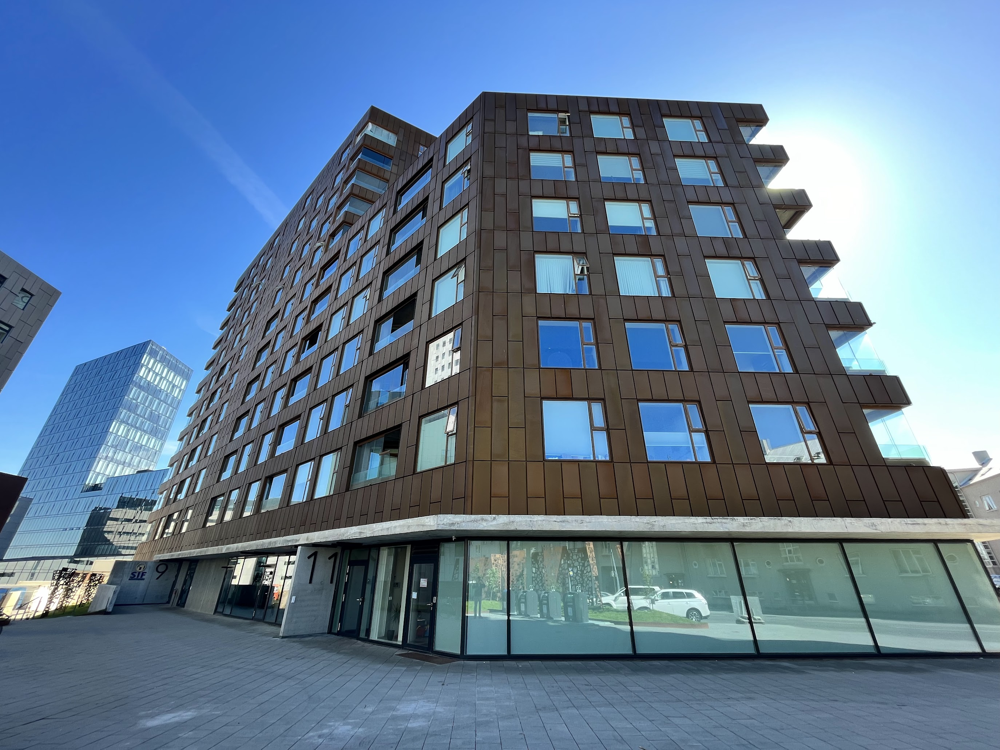
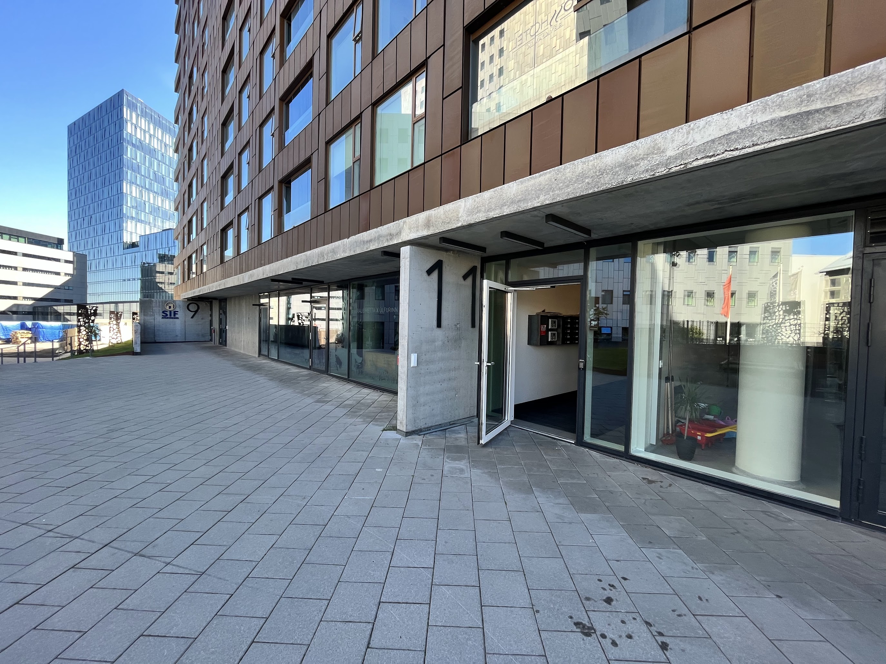
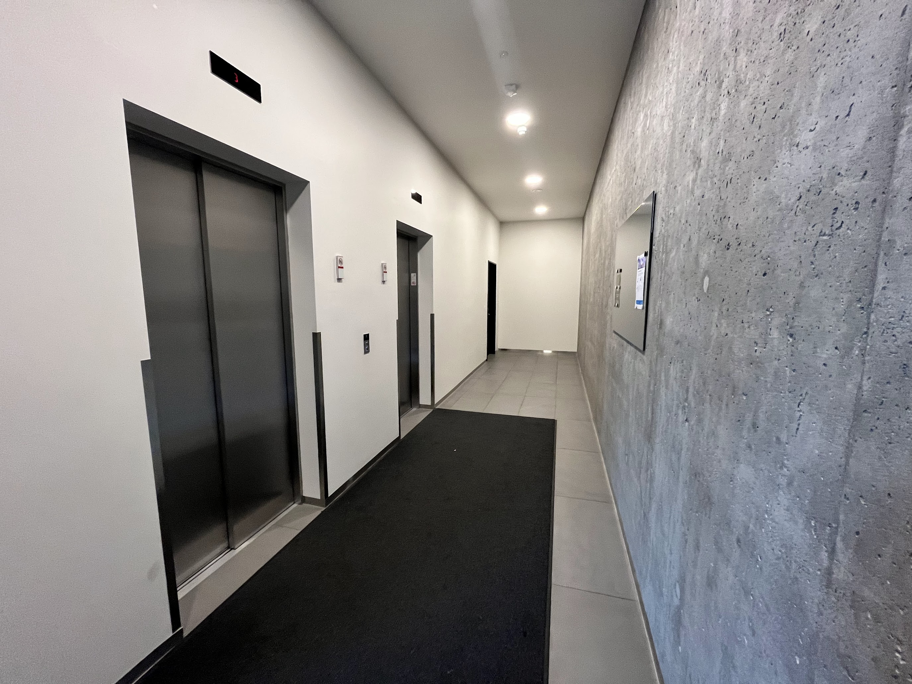
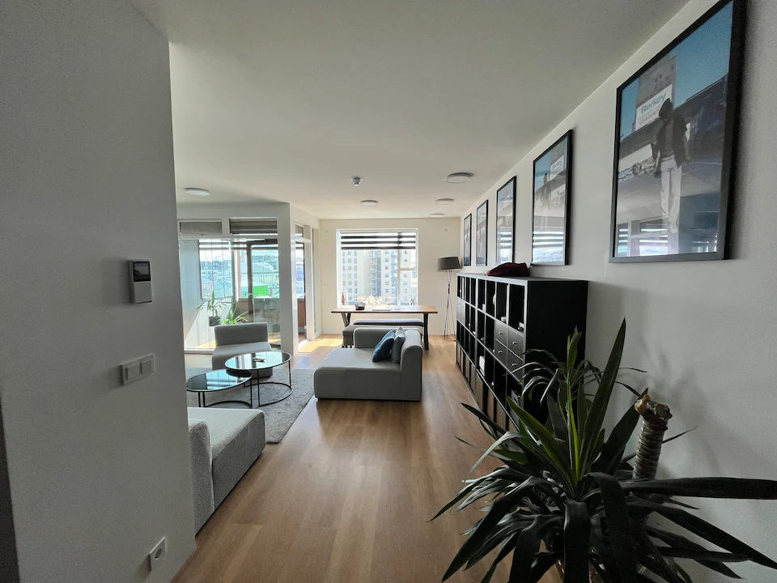
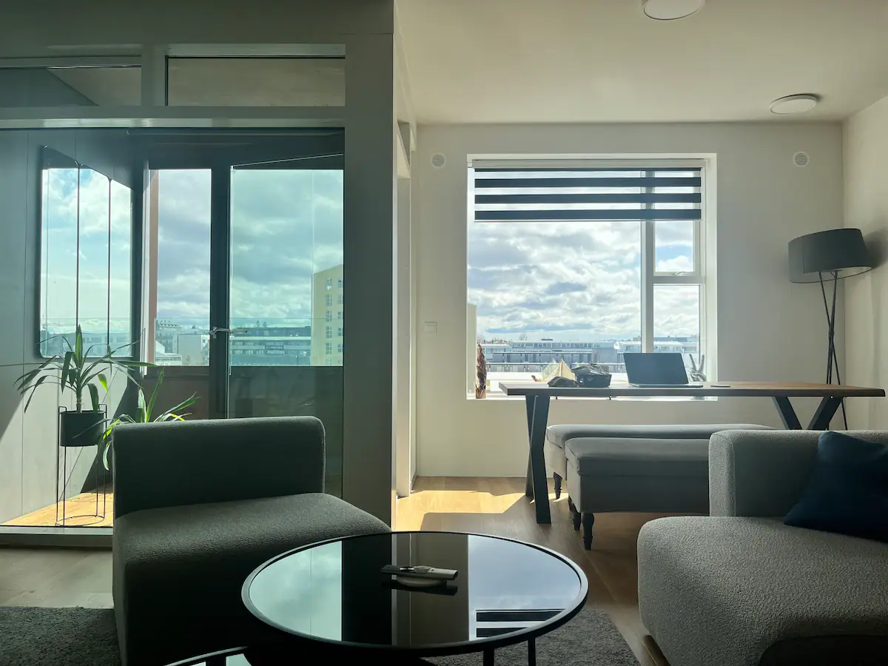
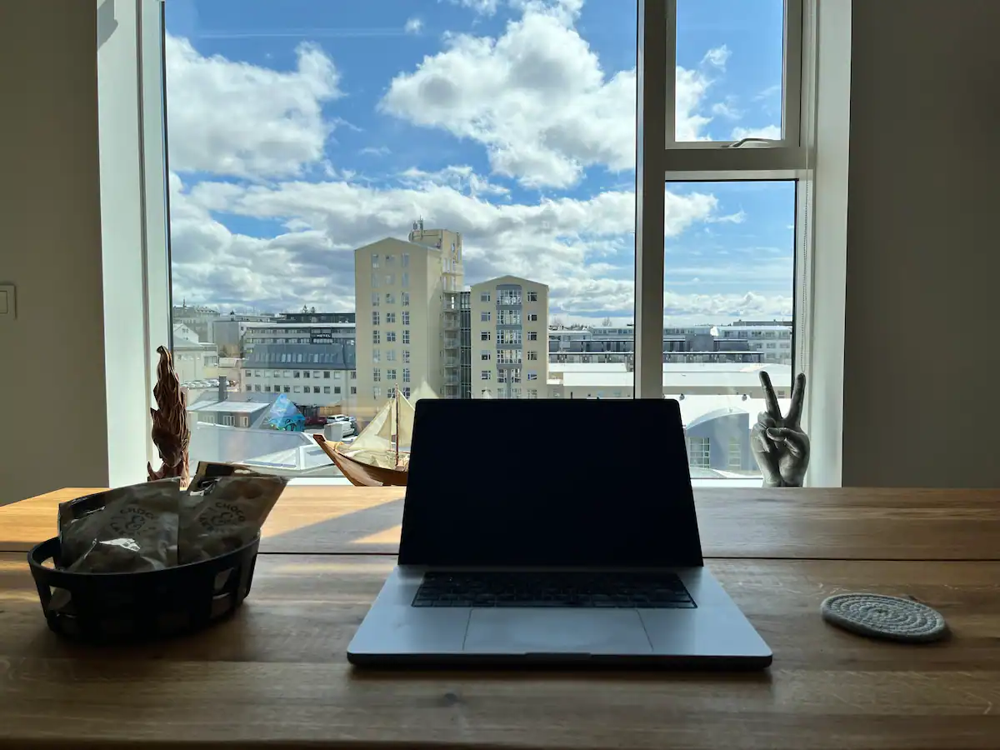
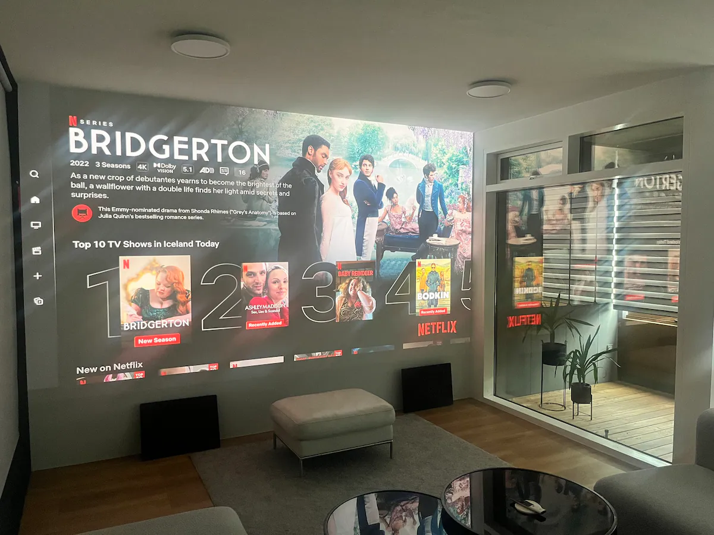
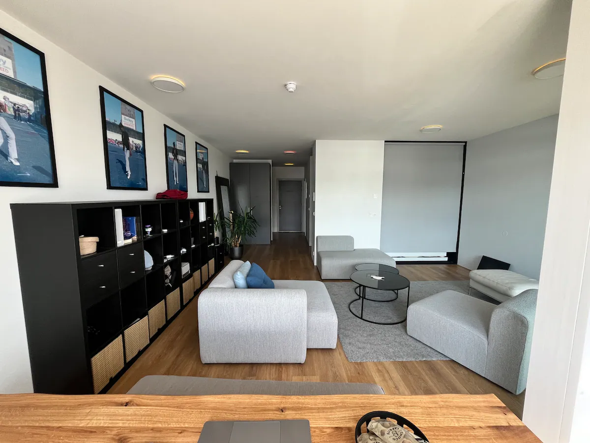
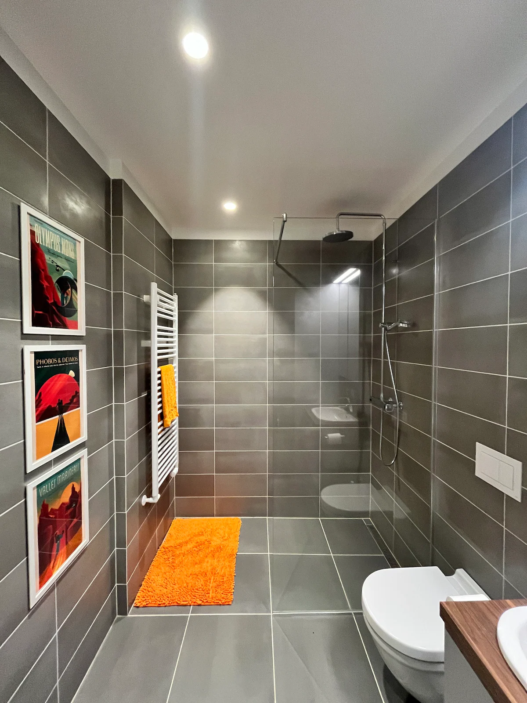
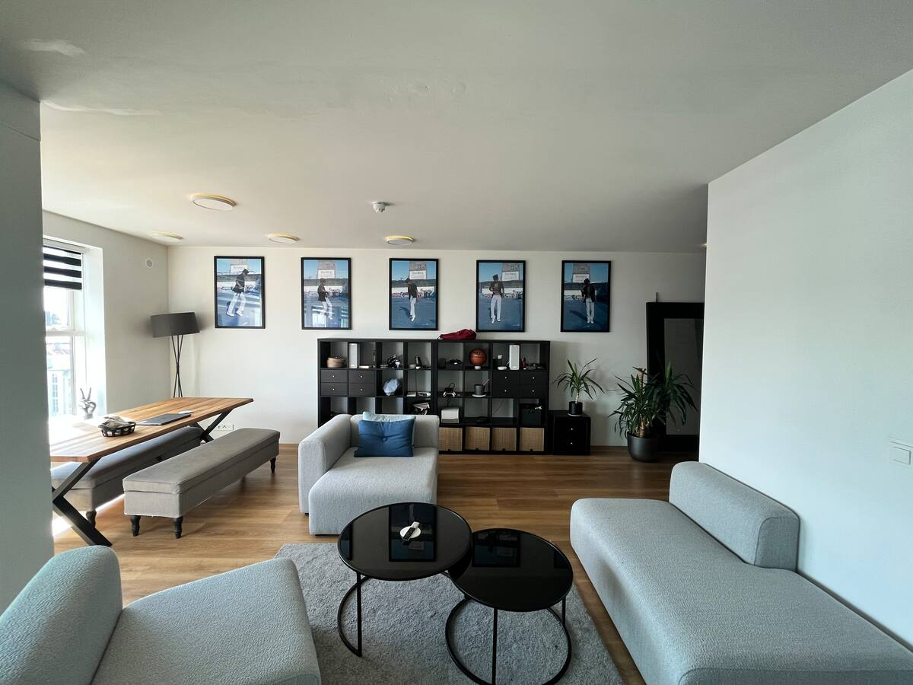
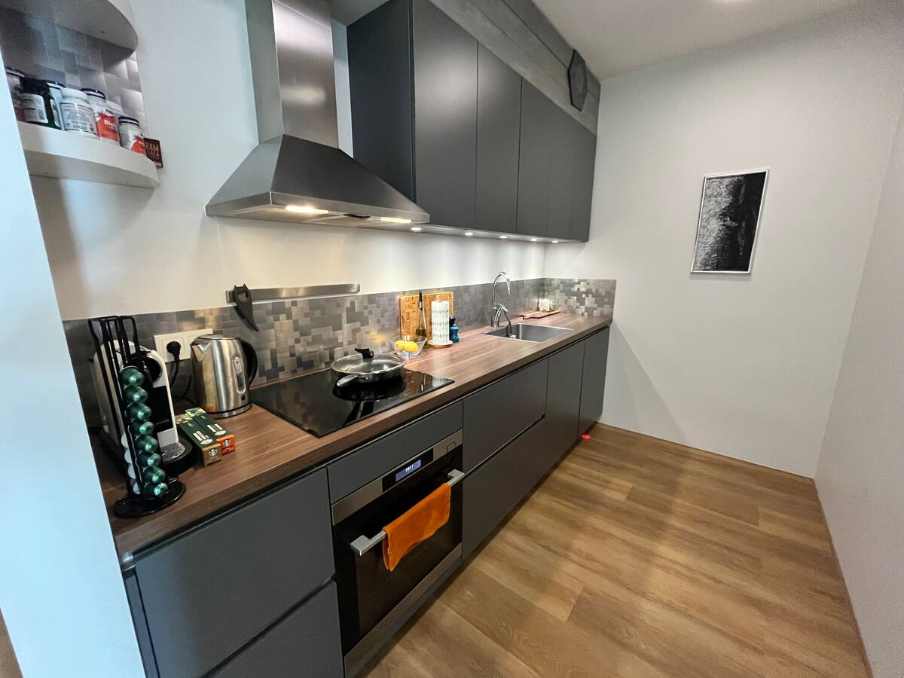
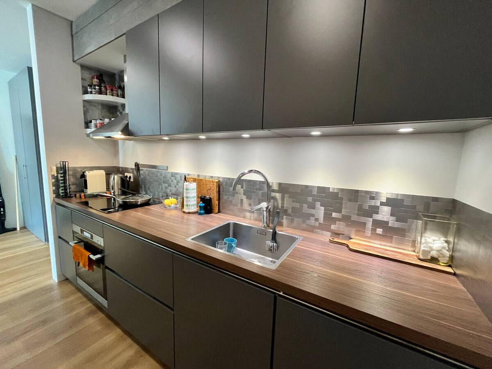
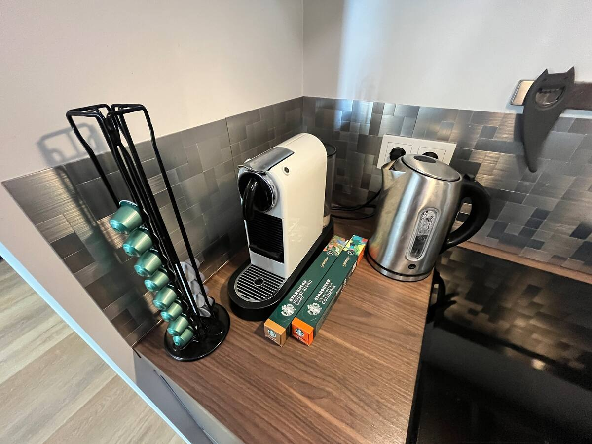

